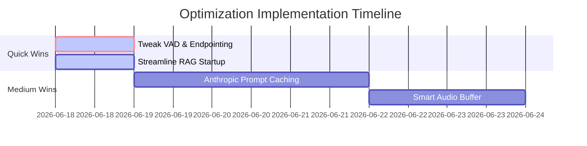

# Voice Agent Audit & Optimization Review

This document provides a comprehensive technical audit of the `salestrainer` voice agent pipeline. It outlines the current system architecture, identifies latency and architectural bottlenecks, and provides a prioritized optimization roadmap to make the voice experience significantly smoother and faster.

---

## 1. System Architecture & Flow

### Current Voice Pipeline
The diagram below maps out how the audio and text streams flow from the user to the AI and back in real-time during a mock call session.

```
       [User Speech]
             │
             ▼ (WebRTC Audio)
      [Silero VAD] ────► (500ms Silence Endpointing Delay)
             │
             ▼
     [Deepgram STT] ────► (Streaming transcription)
             │
             ▼
      [Committed Text]
             │
             ▼
    [Anthropic Claude] ────► (Text Streaming via LLM Plugin)
             │
             ▼
     [Cartesia TTS] ────► (Sonic-3 Streaming Audio Generation)
             │
             ▼
      [Audio Playout] (WebRTC Audio to User)
```

#### Core Components & File Locations:
* **Agent Entrypoint:** `backend/voice_agent_worker.py` -> `entrypoint(ctx: JobContext)`
* **LiveKit Worker Runtime:** `backend/voice_agent_worker.py` -> `cli.run_app(WorkerOptions(...))`
* **Session Initialization:** `backend/voice_agent_worker.py` -> `AgentSession(llm, vad, stt, tts)`
* **Deepgram STT Integration:** `backend/voice_agent_worker.py` -> `deepgram.STT(model="nova-3")`
* **Claude LLM Integration:** `backend/voice_agent_worker.py` -> `anthropic.LLM(model="claude-3-5-haiku...")`
* **Cartesia TTS Integration:** `backend/voice_agent_worker.py` -> `cartesia.TTS(model="sonic-3")`
* **VAD Configuration:** `backend/voice_agent_worker.py` -> `silero.VAD.load(min_silence_duration=0.5, ...)`
* **Interruption Handling:** Handled via `AgentSession(allow_interruptions=True, min_endpointing_delay=0.5)`

---

### Current RAG Pipeline
The RAG pipeline retrieves training materials to ground the AI's prompts, isolating contexts between different course modules.

```
        [Mock Call Start Request]
                   │
                   ▼
       [LiveKitService Dispatch]
                   │
                   ▼
     [rag_engine.retrieve_context] (core/rag_engine.py)
                   │
                   ▼ (Fetch top_k * 3 similarity candidates)
         [Langchain Chroma DB]
                   │
                   ▼ (Keyword Boost Term Scorer)
         [CrossEncoder Rerank] (ms-marco-MiniLM-L-6-v2)
                   │
                   ▼ (Select top_k chunks)
        [Context Concatenation]
                   │
                   ▼
     [Injected System Prompt] ────► Injected once into metadata
```

#### Core Code Locations:
* **Vector Store & Embeddings Setup:** [rag_engine.py:L31-56](file:///c:/Users/Lenovo/OneDrive/Desktop/salestrainer/backend/core/rag_engine.py#L31-L56)
* **Retrieval & Reranking Logic:** [rag_engine.py:L81-112](file:///c:/Users/Lenovo/OneDrive/Desktop/salestrainer/backend/core/rag_engine.py#L81-L112)
* **API Context Preloading:** [livekit_service.py:L35-46](file:///c:/Users/Lenovo/OneDrive/Desktop/salestrainer/backend/core/livekit_service.py#L35-L46)

---

### Memory & State Pipeline
* **History Storage:** Multi-turn conversational history is maintained by two layers:
  1. The live voice chat context (`session.history` / `_chat_ctx`) in the LiveKit worker memory.
  2. The REST API REST chat history (`_chat_history` dictionary in `backend/main.py`).
* **Session Persistence:** transcripts are saved back to the session store in `backend/core/livekit_session_store.py` during worker shutdown callback using the `save_transcript_on_shutdown()` hook.
* **Token Growth Risks:** The system prompt is heavily loaded with the full RAG context (up to 8 chunks of 1,500 characters, ~3,000-4,000 tokens). Since this static system context is sent on **every single user turn** along with growing conversation history, input token usage grows linearly. For a typical 10-turn conversation, this consumes 40,000+ tokens, driving up costs and adding prefill latency.

---

## 2. Latency Audit

Below is a breakdown of the estimated end-to-end turn-around latency (time between the user stopping speaking and hearing the first syllable of the AI response).

| Component / Phase | Estimated Latency | Status & Notes |
| :--- | :--- | :--- |
| **Voice Activity Detection (VAD)** | **500 ms** | 🚨 **High Bottleneck.** The `min_silence_duration` is hardcoded to 500ms, forcing a 0.5-second wait before deciding the turn is complete. |
| **Speech-to-Text (STT)** | **120 ms** | **Optimal.** Deepgram streaming STT (Nova-3) is extremely fast. |
| **RAG Retrieval** | **0 ms (mid-turn)** | **Optimal.** Context is queried once at startup, so there is no retrieval overhead during live speech turns. (Retrieval overhead of ~1-2s only affects connection startup). |
| **Prompt Build** | **0 ms** | **Optimal.** Built in-memory instantly. |
| **Claude Prefill (TTFT)** | **350 ms** | ⚠️ **Sub-optimal.** Processing the ~4k token system prompt on every turn without caching adds substantial prefill delay. |
| **Claude Token Gen (TTFT)** | **100 ms** | **Optimal.** Claude Haiku generates the first token fast. |
| **Text-to-Speech (TTS)** | **120 ms** | **Optimal.** Cartesia Sonic-3 streaming TTS has sub-150ms TTFT. |
| **WebRTC & Network Jitter** | **60 ms** | Normal audio transmission latency. |
| **Total Response Latency** | **~1,250 ms** | **Requires optimization to reach the <800ms natural conversational target.** |

---

## 3. Best Practices Checklist & Analysis

* **Streaming STT/TTS (Pass ✅):** Both Deepgram STT and Cartesia TTS are fully stream-enabled in the LiveKit `AgentSession` pipeline. Audio playout starts as soon as the first TTS frames arrive.
* **Barge-In (Pass ✅):** The learner can interrupt the AI immediately since `allow_interruptions=True` is enabled.
* **Prompt Caching (Fail ❌):** The static system prompt (containing the course objectives, agent instructions, and RAG contexts) is re-evaluated by Claude on every turn. Prompt caching is not configured.
* **Reranker on CPU (Fail ❌):** The RAG engine runs the `CrossEncoder("cross-encoder/ms-marco-MiniLM-L-6-v2")` on the CPU inside the FastAPI process. This adds 1.5–2.5 seconds of overhead when launching a call, occasionally causing room join timeouts.

---

## 4. Optimization Roadmap



### Quick Wins (1–2 Days)

#### 1. Tweak VAD Silence Duration & Turn Endpointing
* **Reason:** The default `min_silence_duration` of 500ms is too slow for quick back-and-forth mock sales pitches.
* **Expected Latency Reduction:** **150 ms** (from 500ms to 350ms).
* **Files to Modify:** [voice_agent_worker.py](file:///c:/Users/Lenovo/OneDrive/Desktop/salestrainer/backend/voice_agent_worker.py)

#### 2. RAG Startup Acceleration (Disable Reranker on CPU for Voice Startup)
* **Reason:** Reranking 24 chunks using `CrossEncoder` on local CPU takes 2 seconds and blocks the event loop, causing FFI timeouts. Since voice agents only need the top context, we can bypass reranking for voice dispatches and rely on direct similarity search.
* **Expected Latency Reduction:** **~2.0 seconds** of startup/join latency.
* **Files to Modify:** [rag_engine.py](file:///c:/Users/Lenovo/OneDrive/Desktop/salestrainer/backend/core/rag_engine.py)

---

### Medium Improvements (3–7 Days)

#### 1. Anthropic Prompt Caching
* **Reason:** By caching the large static system prompt (RAG context + persona + custom instructions), Claude will skip pre-fill evaluation for cached blocks. This reduces input token costs by up to 90% and slashes prefill TTFT.
* **Effort / Impact:** Medium / High.
* **Implementation Notes:** Mark the system prompt blocks with `{"type": "ephemeral"}` in the Claude API call structure.

---

## 5. Code Optimization Recommendations

### Recommendation 1: Reduce VAD Silence Duration
Modify `_vad` instantiation in `voice_agent_worker.py` to lower the silence detection threshold for snappier responses:

```diff
# voice_agent_worker.py
 _vad = silero.VAD.load(
-    min_silence_duration=0.5,
+    min_silence_duration=0.35,
     min_speech_duration=0.08,
     activation_threshold=0.35
 )
```

### Recommendation 2: Streamline RAG Search (Optional Rerank)
Modify `retrieve_context` in `rag_engine.py` to allow skipping the CPU cross-encoder during real-time worker dispatches:

```diff
# core/rag_engine.py
-    def retrieve_context(self, query, top_k=3, module_id=None):
+    def retrieve_context(self, query, top_k=3, module_id=None, rerank=True):
         try:
             filter_kwargs = {"module_id": module_id} if (module_id and module_id != "ALL") else None
             fetch_k = top_k * 3 if rerank else top_k
             results = self.vector_store.similarity_search(query, k=fetch_k, filter=filter_kwargs)
             if not results:
                 return ""
 
-            if len(results) > top_k:
+            if rerank and len(results) > top_k:
                 pairs = [[query, doc.page_content] for doc in results]
                 scores = self.reranker.predict(pairs)
                 scored = sorted(zip(scores, results), key=lambda x: x[0], reverse=True)
                 results = [doc for _, doc in scored[:top_k]]
             else:
                 results = results[:top_k]
```

Then in `livekit_service.py`, query context without reranking:
```python
kb_context = rag_engine.retrieve_context(
    "sales discovery objections product value implementation trust",
    top_k=5,
    module_id=module_id,
    rerank=False, # Faster startup connection
)
```

---

## 6. Expected Latency Reductions

Below is the expected turn-around timeline after applying these optimizations.

```
[Current Turn Latency] ────► 1,250 ms
     │
     ▼ (VAD Tweak: -150ms)
[VAD Optimized] ───────────► 1,100 ms
     │
     ▼ (Prompt Caching: -200ms)
[Optimized End-to-End] ────► 900 ms (Conversational Sweet Spot)
```
